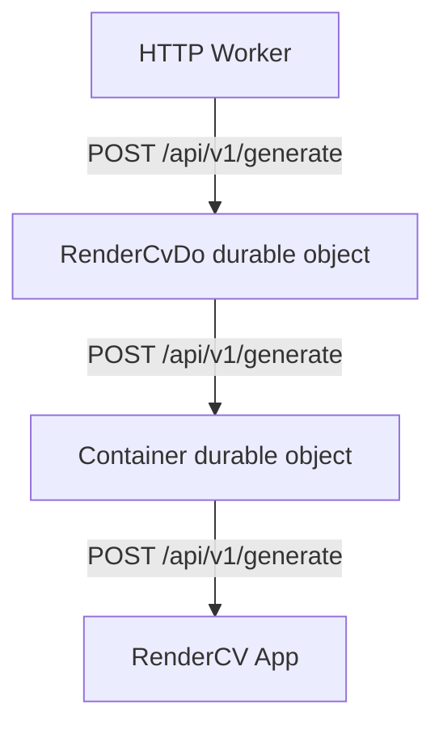

## cf-rendercv

cf-rendercv is a small system for generating PDF resumes using [RenderCV](https://github.com/rendercv/rendercv), composed of:

- `./apps/http`: a Cloudflare Worker that starts a Docker container running the Node.js app and proxies all HTTP requests to that container.
- `./apps/rendercv-app`: a Node.js service running on a host with RenderCV preinstalled. It exposes a single endpoint that accepts RenderCV JSON as input and returns a generated resume as a PDF.

### Architecture

- **Cloudflare Worker (`./apps/http`)**
  - Boots a Docker container when needed.
  - Proxies incoming HTTP traffic to the Node.js app running inside the container.

- **Node.js Resume Generator (`./apps/rendercv-app`)**
  - **Endpoint**: `POST /api/v1/generate`
  - **Request Body**: RenderCV configuration provided as JSON (a JSON equivalent of the RenderCV YAML file).
  - **Response**:
    - `Content-Type: application/pdf`
    - Body is the generated resume PDF.

#### Diagram



See `./apps/rendercv-app/README.md` for detailed API docs and examples.

### Development

At a high level, you will:

1. Install dependencies at the repo root:

   ```bash
   pnpm install
   ```

2. Start the Node.js API locally from the repo root:

   ```bash
   pnpm run dev:api
   ```

3. Send a `POST` request to `http://localhost:<port>/api/v1/generate` with your RenderCV JSON payload and save the `application/pdf` response.

You must have **RenderCV** installed on your local machine for PDF generation to work. See the official RenderCV “Get Started” guide for installation instructions: [Get Started - RenderCV](https://docs.rendercv.com/user_guide/#__tabbed_1_1).

To develop or deploy the Cloudflare Worker in `./apps/http`, refer to that app’s own configuration and scripts (e.g., `wrangler.toml`, `package.json`) for the precise commands.
