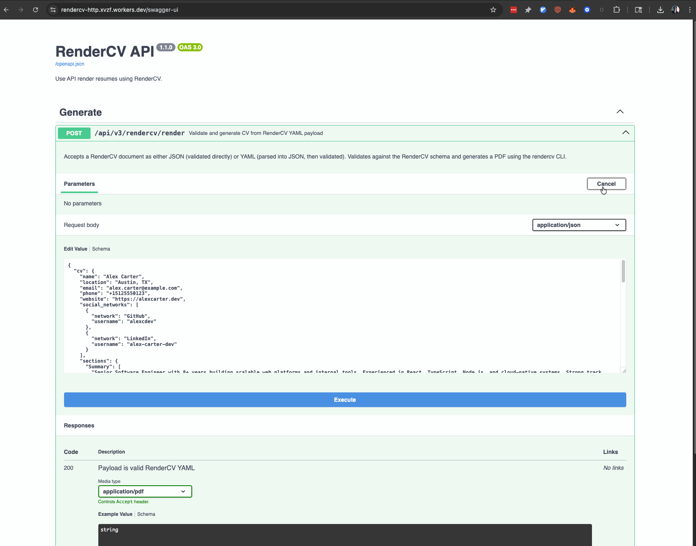
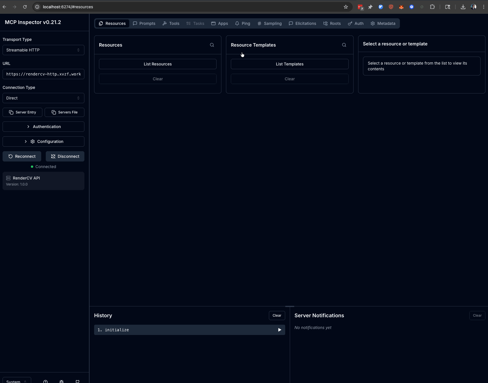
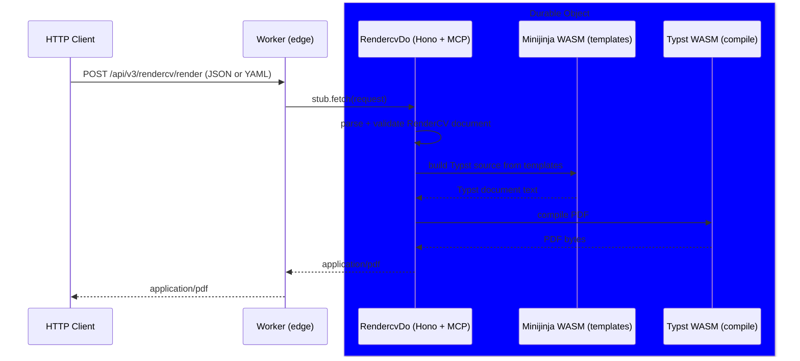
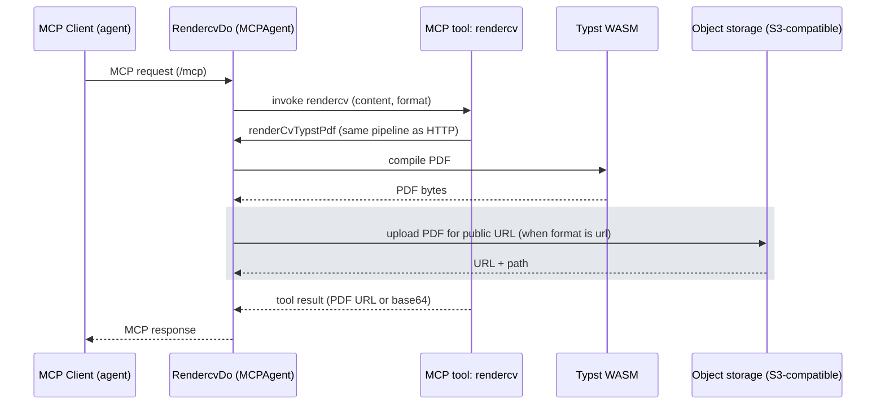
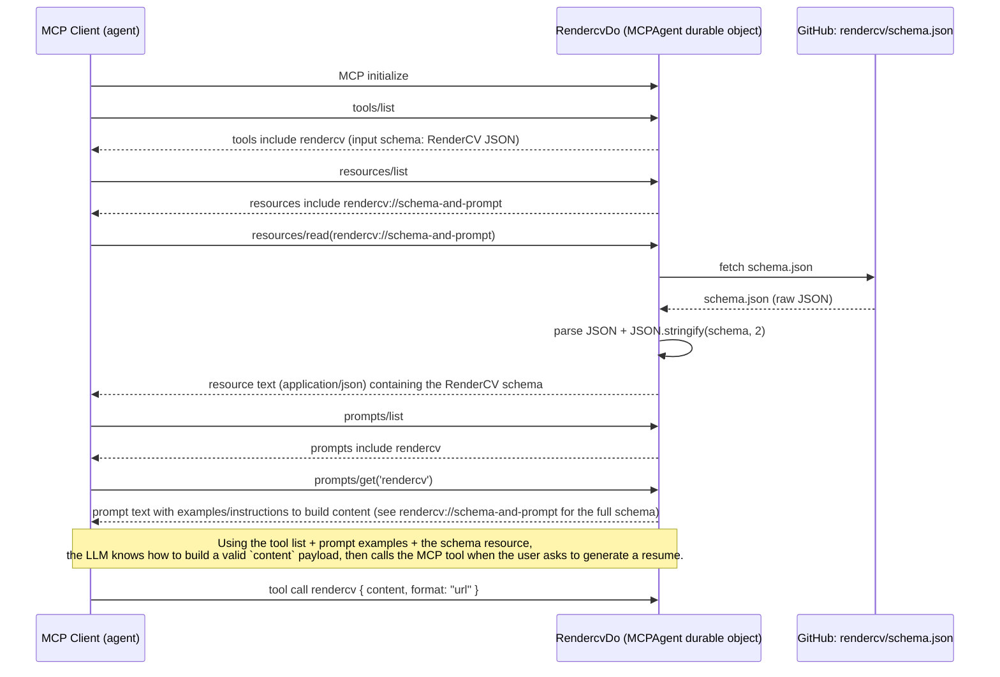

# cf-rendercv

cf-rendercv is an **HTTP API + MCP server** for generating resume PDFs from [RenderCV](https://github.com/rendercv/rendercv)-style YAML or JSON. PDFs are produced **inside Cloudflare Workers** (`workerd`): templates use **Jinja2-compatible** rendering via WASM, and layout is compiled to PDF with **Typst** WASM modules—no subprocesses and no Docker.

<p>
  <a href="https://cursor.com/en-US/install-mcp?name=rendercv&config=eyJ1cmwiOiJodHRwczovL3JlbmRlcmN2LWh0dHAueHZ6Zi53b3JrZXJzLmRldi9tY3AifQ%3D%3D">
    
  </a>
</p>

WebAssembly npm packages used in this repo (optimized for `workerd`):

- [`@jchoi2x/minijinja` (`^0.0.13`)](https://github.com/jchoi2x/minijinja) — Jinja2-style templating
- [`@jchoi2x/typst.ts` (`0.7.4`)](https://github.com/jchoi2x/typst.ts.git)
- [`@jchoi2x/typst-ts-renderer` (`0.7.5`)](https://github.com/jchoi2x/typst.ts.git)
- [`@jchoi2x/typst-ts-web-compiler` (`^0.7.11`)](https://github.com/jchoi2x/typst.ts.git)

## Projects

The apps are:

- `./apps/http`
  - Cloudflare Worker ([Hono](https://hono.dev))
  - MCPAgent (MCP tool/agent wiring)
  - hosts an MCP server that registers the `rendercv` tool, prompts, and JSON schema resources (see `./apps/http/src/durable/mcp/rendercv/`)
  - renders PDFs in the Durable Object using Minijinja + Typst WASM (same pipeline as HTTP)

## Architecture

- **Cloudflare Worker (`./apps/http`)**
  - Proxies HTTP and MCP traffic to a **Durable Object** (`RendercvDo`) that hosts the Hono app, MCP server, and rendering pipeline.
  - **Rendering**: validate RenderCV JSON/YAML → build Typst source (Jinja via Minijinja WASM) → compile PDF with Typst WASM.
  - Exposes `POST /api/v3/rendercv/render` (PDF) and `POST /api/v3/rendercv/typst` (Typst source). Request bodies accept RenderCV as JSON or YAML (see OpenAPI/Swagger).

## Rendering via HTTP and MCP

This Worker supports using RenderCV in two ways:

- **HTTP API**: `POST /api/v3/rendercv/render` returns a generated PDF (`application/pdf`). `POST /api/v3/rendercv/typst` returns Typst source (`application/text`). Bodies may be RenderCV JSON or YAML.
- **MCP tool**: the Worker registers an MCP tool named `rendercv` that accepts `{ content, format }` and returns a generated PDF URL (or base64 when `format: "base64"`).

The Worker also registers:

- a prompt named `rendercv`
- a resource at `rendercv://schema-and-prompt` containing the RenderCV JSON schema

## Deployment

The application is deployed at **[https://rendercv-http.xvzf.workers.dev/](https://rendercv-http.xvzf.workers.dev/)** (HTTP API, OpenAPI/Swagger UI, and MCP).

### OpenAPI (Swagger UI)



### MCP Inspector

Run the Model Context Protocol Inspector and connect to the deployed MCP server:

```bash
npx @modelcontextprotocol/inspector@latest
```



## Development

At a high level, you will:

### Prerequisites

- node >= 20
- bun >= 1.1.0

### Google OAuth (required for local MCP)

The HTTP/MCP server uses Google OAuth for authentication.

To run locally, you must set up a Google OAuth client application in the Google Cloud console: https://console.cloud.google.com/auth/clients/create
After creating the app, configure the resulting `GOOGLE_CLIENT_ID` and `GOOGLE_CLIENT_SECRET` for the worker.

### Steps

1. Install dependencies at the repo root:

   ```bash
   bun install
   ```

2. Start the cloudflare worker locally from the repo root:

   ```bash
   bun run dev:http
   ```

3. Send a `POST` request to `http://localhost:<port>/api/v3/rendercv/render` with your RenderCV JSON or YAML body and save the `application/pdf` response. Use `POST /api/v3/rendercv/typst` for Typst source output.

For document structure and field semantics, see the official RenderCV user guide: [RenderCV — User guide](https://docs.rendercv.com/user_guide/).

To develop or deploy the Cloudflare Worker in `./apps/http`, refer to that app’s own configuration and scripts (e.g., `wrangler.jsonc`, `package.json`) for the precise commands.

## Testing

- **Unit tests** live next to source under `apps/**/src/**/__tests__/` (see `.cursor/rules/unit-testing.mdc`). From the repo root run `bun run test`, `bun run test:http`, or `bun run test:unit` as documented in `package.json`.

End-to-end checks that exercise the full Typst compilation path (for example a successful `POST /api/v3/rendercv/render` with a complete RenderCV document) require `bun run dev:http` or a deployed Worker.

## Debugging

Use the `@modelcontextprotocol/inspector` tool to debug the MCP server.

```bash
npx @modelcontextprotocol/inspector@latest
```

## Diagrams

<details>

<summary>Sequence Diagram (HTTP)</summary>

### Sequence (HTTP)

Rendering a resume via HTTP request



</details>

<details>

<summary>Sequence Diagram (MCP)</summary>

### Sequence (MCP)

MCP is the Model Context Protocol, a protocol for building agents that can interact with other agents and tools.



</details>

<details>
<summary>Sequence Diagram (MCP Discovery)</summary>

### MCP Discovery (tools/resources/prompts)

Discovery is the process of the MCP client (agent) discovering the tools, resources, and prompts available on the MCP server.



</details>
