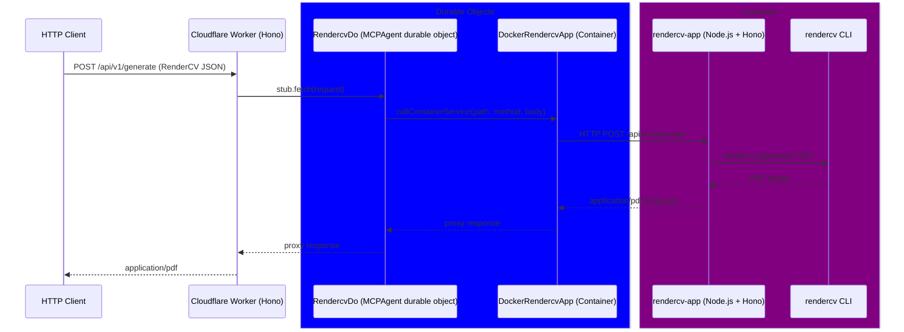
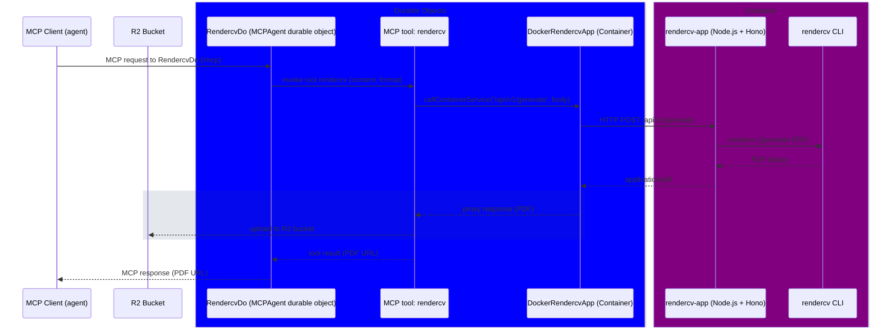
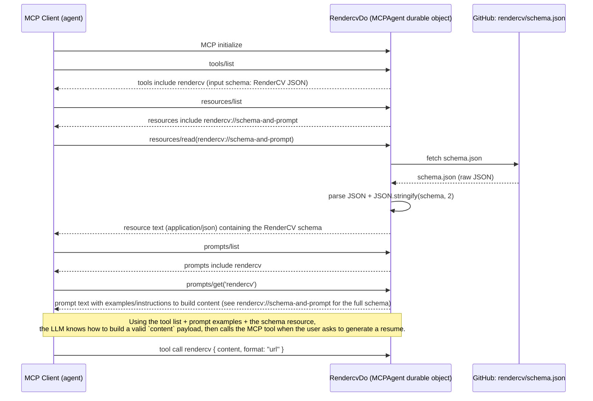

# cf-rendercv

cf-rendercv is an **HTTP API + MCP server** for generating resume PDFs using the `rendercv` **CLI**.

`rendercv` is a CLI tool and is not readily portable to run inside Cloudflare `workerd`. To work around this, the repo uses **Cloudflare Containers** to run a **Docker container** that has the `rendercv` CLI available. A Node.js server wraps the CLI and exposes an HTTP endpoint; the Cloudflare Worker proxies requests to it.

## Projects

The apps are:

- `./apps/http`
  - Cloudflare Worker (Hono)
  - MCPAgent (MCP tool/agent wiring)
  - hosts an MCP server that registers the `rendercv` tool, plus a prompt and a JSON schema resource
  - handles MCP tool calls by routing them to the container-backed PDF generator
  - Cloudflare Container (starts/manages the Docker container lifecycle)
- `./apps/rendercv-app` (lives inside the Docker container)
  - Node.js HTTP server
  - Hono + Swagger routes
  - Executes `rendercv` to generate the returned `application/pdf`

## Architecture

- **Cloudflare Worker (`./apps/http`)**
  - Boots a Docker container when needed.
  - Proxies incoming HTTP traffic to the Node.js app running inside the container.

- **Node.js Resume Generator (`./apps/rendercv-app`)**
  - **Endpoint**: `POST /api/v1/generate`
  - **Request Body**: RenderCV configuration provided as JSON (a JSON equivalent of the RenderCV YAML file).
  - **Response**:
    - `Content-Type: application/pdf`
    - Body is the generated resume PDF.

## Diagrams

### Sequence (HTTP)

Rendering a resume via HTTP request



### Sequence (MCP)

MCP is the Model Context Protocol, a protocol for building agents that can interact with other agents and tools.



### MCP Discovery (tools/resources/prompts)

Discovery is the process of the MCP client (agent) discovering the tools, resources, and prompts available on the MCP server.



### Rendering via HTTP and MCP

This Worker supports using RenderCV in two ways:

- **HTTP API**: `POST /api/v1/generate` (RenderCV configuration as JSON) returns a generated PDF.
- **MCP tool**: the Worker registers an MCP tool named `rendercv` that accepts `{ content, format }` and returns a generated PDF URL (or base64 when `format: "base64"`).

The Worker also registers:

- a prompt named `rendercv`
- a resource at `rendercv://schema-and-prompt` containing the RenderCV JSON schema

See `./apps/rendercv-app/README.md` for detailed API docs and examples.

## Development

At a high level, you will:

### Prerequisites

- `docker`
- node >= 20
- pnpm >= 10.30.3

### Steps

1. Install dependencies at the repo root:

   ```bash
   pnpm install
   ```

2. Start the cloudflare worker and api locally from the repo root:

   ```bash
   pnpm run dev:http
   ```

3. Start the Node.js API locally from the repo root:

   ```bash
   pnpm run dev:api
   ```

4. Send a `POST` request to `http://localhost:<port>/api/v1/generate` with your RenderCV JSON payload and save the `application/pdf` response.

You must have **rendercv** installed on your local machine for PDF generation to work. See the official RenderCV “Get Started” guide for installation instructions: [Get Started - RenderCV](https://docs.rendercv.com/user_guide/#__tabbed_1_1).

To develop or deploy the Cloudflare Worker in `./apps/http`, refer to that app’s own configuration and scripts (e.g., `wrangler.toml`, `package.json`) for the precise commands.

## Debugging

Use the `@modelcontextprotocol/inspector` tool to debug the MCP server.

```bash
npx @modelcontextprotocol/inspector@latest
```
